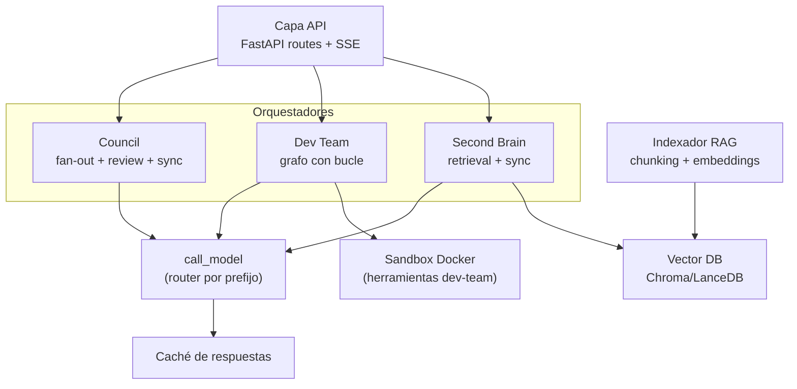

# C4 Nivel 3 · Componentes (interior del backend)

```mermaid
flowchart TB
    api["Capa API<br/>FastAPI routes + SSE"]

    subgraph orch["Orquestadores"]
        oc["Council<br/>fan-out + review + sync"]
        od["Dev Team<br/>grafo con bucle"]
        os["Second Brain<br/>retrieval + sync"]
    end

    router["call_model<br/>(router por prefijo)"]
    cache["Caché de respuestas"]
    index["Indexador RAG<br/>chunking + embeddings"]
    vdb["Vector DB<br/>Chroma/LanceDB"]
    sandbox["Sandbox Docker<br/>(herramientas dev-team)"]

    api --> oc & od & os
    oc --> router
    od --> router
    od --> sandbox
    os --> router
    os --> vdb
    index --> vdb
    router --> cache
```

El indexador alimenta la vector DB (offline). El sandbox solo lo usa el dev-team. La caché envuelve `call_model`.
