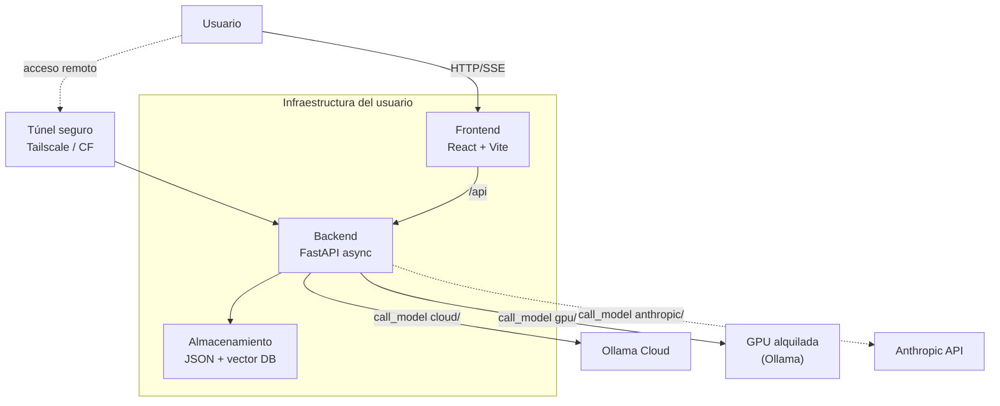

# C4 Nivel 2 · Contenedores

```mermaid
flowchart TB
    user["Usuario"]

    subgraph local["Infraestructura del usuario"]
        fe["Frontend<br/>React + Vite"]
        be["Backend<br/>FastAPI async"]
        store["Almacenamiento<br/>JSON + vector DB"]
    end

    cloud["Ollama Cloud"]
    gpu["GPU alquilada<br/>(Ollama)"]
    anthropic["Anthropic API"]
    tunnel["Túnel seguro<br/>Tailscale / CF"]

    user -->|HTTP/SSE| fe
    user -.->|acceso remoto| tunnel
    tunnel --> be
    fe -->|/api| be
    be --> store
    be -->|call_model cloud/| cloud
    be -->|call_model gpu/| gpu
    be -.->|call_model anthropic/| anthropic
```

Todo lo de `local` corre en infraestructura del usuario. `call_model` es el único punto que habla con los destinos de modelo.
