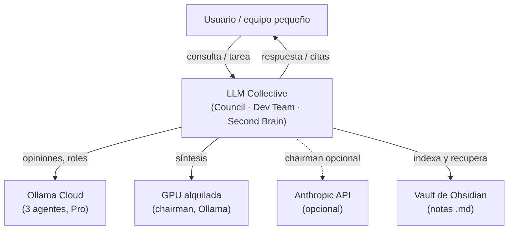

# C4 Nivel 1 · Contexto

```mermaid
flowchart TB
    user["Usuario / equipo pequeño"]
    sys["LLM Collective<br/>(Council · Dev Team · Second Brain)"]
    cloud["Ollama Cloud<br/>(3 agentes, Pro)"]
    gpu["GPU alquilada<br/>(chairman, Ollama)"]
    anthropic["Anthropic API<br/>(opcional)"]
    obsidian["Vault de Obsidian<br/>(notas .md)"]

    user -->|consulta / tarea| sys
    sys -->|respuesta / citas| user
    sys -->|opiniones, roles| cloud
    sys -->|síntesis| gpu
    sys -.->|chairman opcional| anthropic
    sys -->|indexa y recupera| obsidian
```

El usuario interactúa solo con LLM Collective. El sistema orquesta tres destinos de modelo y lee el vault de Obsidian para el Second Brain.
