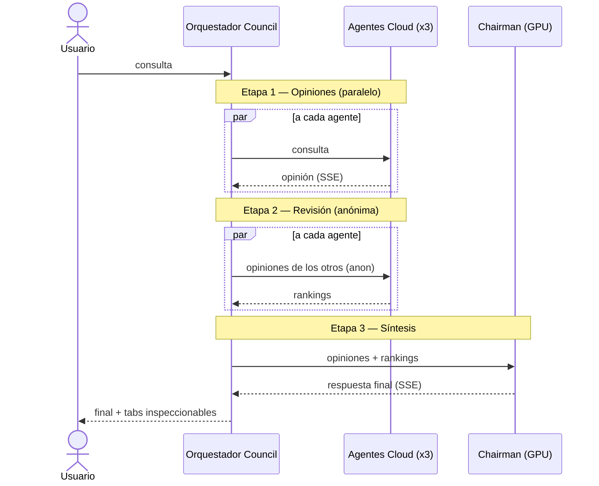

# Secuencia · Council

```mermaid
sequenceDiagram
    actor U as Usuario
    participant O as Orquestador Council
    participant A as Agentes Cloud (x3)
    participant C as Chairman (GPU)

    U->>O: consulta
    Note over O,A: Etapa 1 — Opiniones (paralelo)
    par a cada agente
        O->>A: consulta
        A-->>O: opinión (SSE)
    end
    Note over O,A: Etapa 2 — Revisión (anónima)
    par a cada agente
        O->>A: opiniones de los otros (anon)
        A-->>O: rankings
    end
    Note over O,C: Etapa 3 — Síntesis
    O->>C: opiniones + rankings
    C-->>O: respuesta final (SSE)
    O-->>U: final + tabs inspeccionables
```
