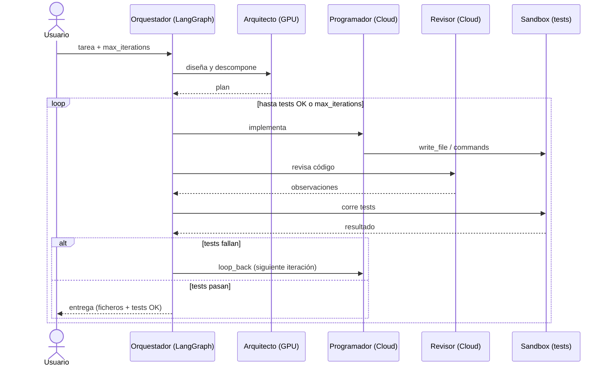

# Secuencia · Dev Team

```mermaid
sequenceDiagram
    actor U as Usuario
    participant O as Orquestador (LangGraph)
    participant AR as Arquitecto (GPU)
    participant PR as Programador (Cloud)
    participant RV as Revisor (Cloud)
    participant SB as Sandbox (tests)

    U->>O: tarea + max_iterations
    O->>AR: diseña y descompone
    AR-->>O: plan
    loop hasta tests OK o max_iterations
        O->>PR: implementa
        PR->>SB: write_file / commands
        O->>RV: revisa código
        RV-->>O: observaciones
        O->>SB: corre tests
        SB-->>O: resultado
        alt tests fallan
            O->>PR: loop_back (siguiente iteración)
        else tests pasan
            O-->>U: entrega (ficheros + tests OK)
        end
    end
```
