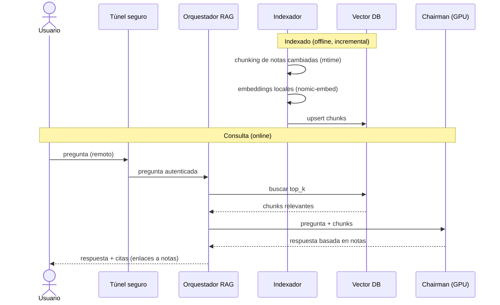

# Secuencia · Second Brain

```mermaid
sequenceDiagram
    actor U as Usuario
    participant T as Túnel seguro
    participant O as Orquestador RAG
    participant I as Indexador
    participant V as Vector DB
    participant C as Chairman (GPU)

    Note over I,V: Indexado (offline, incremental)
    I->>I: chunking de notas cambiadas (mtime)
    I->>I: embeddings locales (nomic-embed)
    I->>V: upsert chunks

    Note over U,C: Consulta (online)
    U->>T: pregunta (remoto)
    T->>O: pregunta autenticada
    O->>V: buscar top_k
    V-->>O: chunks relevantes
    O->>C: pregunta + chunks
    C-->>O: respuesta basada en notas
    O-->>U: respuesta + citas (enlaces a notas)
```
